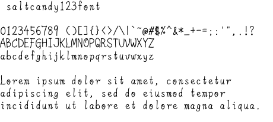

# saltcandy123font

@saltcandy123 による手書きフォントです。

This is a handwritten font created by @saltcandy123.

- Download saltcandy123font from [the latest release page](https://github.com/saltcandy123/saltcandy123font/releases/latest).
- An npm package ([@saltcandy123/saltcandy123font](https://www.npmjs.com/package/@saltcandy123/saltcandy123font)) is also available.

## Supported characters

- (U+0000 - U+007F) Basic Latin (ASCII)
  - Glyphs: [`glyphs/basic-latin`](glyphs/basic-latin)
- (U+3040 - U+309F) Hiragana
  - Glyphs: [`glyphs/hiragana`](glyphs/hiragana)
- (U+30A0 - U+30FF) Katakana
  - Glyphs: [`glyphs/katakana`](glyphs/katakana)

## Source code

- **`glyphs/xxxx/uXXXX.svg`** defines the shape of each character. For example, [`u0073.svg`](glyphs/basic-latin/u0073.svg) is the image of "s" (U+0073). A character may have another image (`uXXXX-vert.svg`) for vertical writing ("vert" feature).
- **[`scripts/build_font.py`](scripts/build_font.py)** builds a font from the glyph SVG files. This Python script requires [FontForge](https://fontforge.org/) and [its Python library](https://fontforge.org/docs/scripting/python.html).
- **[`scripts/clean_glyphs.py`](scripts/clean_glyphs.py)** cleans SVG files by removing extra data from SVG.
- **[`scripts/build-dist.sh`](scripts/build-dist.sh)** builds distribution files under `dist` directory.
- **[`scripts/generate-fontimage.sh`](scripts/generate-fontimage.sh)** produces a font thumbnail image.
