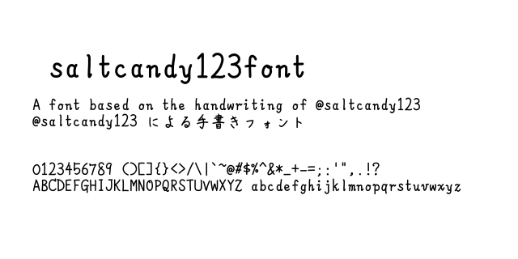

# saltcandy123font

@saltcandy123 による手書きフォントです。

This is a simple handwritten font created by @saltcandy123.

- Download the `ttf` file and the `woff` from [the release page](https://github.com/saltcandy123/saltcandy123font/releases).
- An npm package ([@saltcandy123/saltcandy123font](https://www.npmjs.com/package/@saltcandy123/saltcandy123font)) is also available.

## Source code

- **`glyphs/uXXXX.svg`** defines the shape of each character. For example, [`u0041.svg`](glyphs/u0041.svg) is the image of "A".
- **[`build_font.py`](build_font.py)** is a script to convert the glyph SVG files to font files in `dist` directory. It also adds a few additional files for the npm package. The Python script requires [FontForge](https://fontforge.org/) and [its Python library](https://fontforge.org/docs/scripting/python.html).
- **[`clean_glyphs.py`](clean_glyphs.py)** is a script to clean and normalize SVG files. `--add-template` flag draws template lines on each SVG, which is useful for working on individual glyphs.
